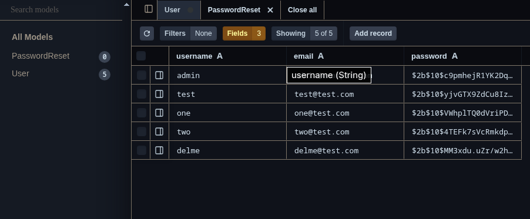
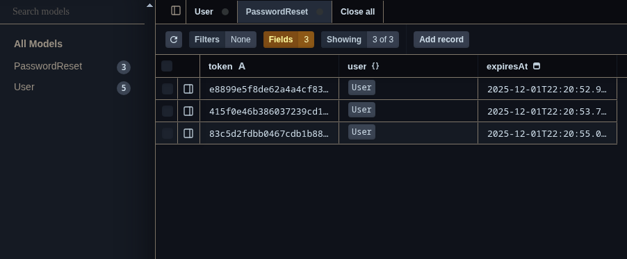

# User Management System

A robust and secure user management system built with **Node.js**, **Fastify**, **Prisma**, and **TypeScript**. This REST API provides comprehensive user authentication, OAuth integration, profile management, and admin capabilities.

[](https://opensource.org/licenses/MIT)
[](https://www.typescriptlang.org/)
[](https://www.fastify.io/)

## ✨ Features

### 🔐 Authentication System
- **Traditional Authentication**: Username/password login with JWT tokens
- **OAuth Integration**: GitHub OAuth 2.0 authentication
- **Session Management**: HTTP-only cookies for enhanced security
- **Password Reset**: Secure token-based password recovery via email
- **Token Expiration**: 7-day JWT token validity

### 👤 User Profile Management
- View and update user profiles
- Email and password updates
- Account deletion (self-service)
- Secure password hashing with bcrypt

### 🛡️ Admin Panel
- User listing and search
- User management (view, update, delete)
- Role-based access control (User/Admin)
- Bulk user operations

### ⚡ Modern Tech Stack
- **Fastify** - Fast and low overhead web framework
- **Prisma** - Next-generation ORM with type safety
- **TypeScript** - Type-safe development
- **SQLite** - Lightweight embedded database
- **JWT** - Secure authentication tokens
- **Nodemailer** - Email service integration
- **bcrypt** - Industry-standard password hashing

## 📋 Prerequisites

- **Node.js** v14 or higher
- **npm** or **yarn**
- **Git** (for cloning)

## 🚀 Installation

### 1. Clone the repository
```bash
git clone <repository-url>
cd ums_test
```

### 2. Install dependencies
```bash
npm install
```

### 3. Configure environment variables

Copy the example environment file and configure your settings:
```bash
cp .example_env .env
```

**Required Environment Variables:**
```env
# JWT Secret (use a strong random string in production)
JWT_SEC=your-super-secret-jwt-key

# Database
DATABASE_URL="file:./usermgmt.db"

# Server
PORT=3000

# GitHub OAuth (optional - for OAuth login)
GITHUB_CLIENT_ID=your_github_client_id
GITHUB_CLIENT_SECRET=your_github_client_secret

# Email Configuration (for password reset)
EMAIL_HOST=smtp.gmail.com
EMAIL_PORT=587
EMAIL_USER=your-email@gmail.com
EMAIL_PASS=your-app-password
EMAIL_FROM="User Management <noreply@yourdomain.com>"

# Frontend URL (for redirects and email links)
FRONTEND_URL=http://localhost:5000

# Cookie Secret (use a strong random string)
COOKIE_SECRET=your-super-secure-cookie-secret
```

### 4. Setup database

Generate Prisma client:
```bash
npx prisma generate
```

Run database migrations:
```bash
npx prisma migrate dev --name init
```

### 5. Start the server

**Development mode** (with hot reload):
```bash
npm run dev
```

**Production mode**:
```bash
npm run build
npm start
```

The server will start on `http://localhost:3000` (or your configured PORT).

## 📁 Project Structure

```
ums_test/
├── .env                      # Environment variables (gitignored)
├── .example_env              # Environment variables template
├── openapi.yaml              # OpenAPI 3.0 specification
├── package.json              # Dependencies and scripts
├── tsconfig.json             # TypeScript configuration
├── prisma/
│   ├── migrations/           # Database migration files
│   └── schema.prisma         # Prisma schema definition
├── src/
│   ├── db.ts                 # Database operations and utilities
│   ├── server.ts             # Main application entry point
│   ├── middelware/
│   │   ├── admin.ts          # Admin authorization middleware
│   │   └── auth.ts           # JWT authentication middleware
│   ├── routes/
│   │   ├── auth.ts           # Authentication endpoints
│   │   └── users.ts          # User management endpoints
│   ├── services/
│   │   └── email.ts          # Email service (password reset)
│   └── types/
│       └── ...               # TypeScript type definitions
└── imgs/                     # Documentation images
```

## 📚 API Documentation

### Interactive Documentation

Once the server is running, access the **Swagger UI** documentation at:
```
http://localhost:3000/docs
```

### API Endpoints Overview

#### Authentication Endpoints

| Method | Endpoint | Description | Auth Required |
|--------|----------|-------------|---------------|
| POST | `/api/auth/register` | Register a new user | No |
| POST | `/api/auth/login` | Login user (returns JWT + sets cookie) | No |
| POST | `/api/auth/logout` | Logout user (clears cookie) | No |
| POST | `/api/auth/forgot-password` | Request password reset email | No |
| POST | `/api/auth/reset-password` | Reset password with token | No |
| GET | `/api/auth/github` | Initiate GitHub OAuth flow | No |
| GET | `/api/auth/github/callback` | GitHub OAuth callback | No |

#### User Profile Endpoints

| Method | Endpoint | Description | Auth Required |
|--------|----------|-------------|---------------|
| GET | `/api/users/me` | Get current user profile | Yes (User) |
| PUT | `/api/users/me` | Update current user profile | Yes (User) |
| DELETE | `/api/users/me` | Delete current user account | Yes (User) |

#### Admin Endpoints

| Method | Endpoint | Description | Auth Required |
|--------|----------|-------------|---------------|
| GET | `/api/users` | Get all users | Yes (Admin) |
| GET | `/api/users/{id}` | Get user by ID | Yes (Admin) |
| PUT | `/api/users/{id}` | Update user by ID | Yes (Admin) |
| DELETE | `/api/users/{id}` | Delete user by ID | Yes (Admin) |

### Authentication Methods

This API supports **two authentication methods**:

1. **Bearer Token**: Include JWT in the `Authorization` header
   ```
   Authorization: Bearer <your-jwt-token>
   ```

2. **HTTP-only Cookie**: Automatically set after login (recommended for web apps)
   - Cookie name: `authToken`
   - Secure, HttpOnly, SameSite=None
   - 7-day expiration

## 🗄️ Database Schema

### User Table
Stores user account information including credentials and profile data.



**Fields:**
- `id` - Primary key
- `username` - Unique username (4-16 characters)
- `email` - Unique email address
- `password` - Bcrypt hashed password
- `role` - User role (user/admin)
- `githubId` - GitHub user ID (for OAuth users)
- `createdAt` - Account creation timestamp
- `updatedAt` - Last update timestamp

### PasswordReset Table
Manages password reset tokens and their expiration times for secure password recovery.



**Fields:**
- `id` - Primary key
- `userId` - Foreign key to User
- `token` - Unique reset token
- `expiresAt` - Token expiration timestamp
- `createdAt` - Token creation timestamp

## 🔒 Security Features

- ✅ **Password Hashing**: bcrypt with salt rounds
- ✅ **JWT Authentication**: Secure token-based auth
- ✅ **HTTP-only Cookies**: XSS protection
- ✅ **CORS Configuration**: Cross-origin request handling
- ✅ **Role-based Access Control**: User/Admin permissions
- ✅ **Secure Password Reset**: Time-limited tokens
- ✅ **Input Validation**: Request schema validation
- ✅ **OAuth 2.0**: GitHub authentication integration

## 🛠️ Development

### Available Scripts

```bash
# Development with hot reload
npm run dev

# Build TypeScript to JavaScript
npm run build

# Start production server
npm start

# Clean build artifacts
npm run clean

# Clean and reinstall dependencies
npm run reinstall
```

### Database Management

**View database in Prisma Studio:**
```bash
npx prisma studio
```

**Create a new migration:**
```bash
npx prisma migrate dev --name <migration-name>
```

**Reset database:**
```bash
npx prisma migrate reset
```

**Generate Prisma Client after schema changes:**
```bash
npx prisma generate
```

## 🌐 Setting Up GitHub OAuth

1. **Create a GitHub OAuth App:**
   - Go to GitHub Settings → Developer settings → OAuth Apps
   - Click "New OAuth App"
   - Set Authorization callback URL to: `http://localhost:3000/api/auth/github/callback`

2. **Configure Environment Variables:**
   ```env
   GITHUB_CLIENT_ID=your_client_id_here
   GITHUB_CLIENT_SECRET=your_client_secret_here
   ```

3. **Update Frontend URL:**
   ```env
   FRONTEND_URL=http://localhost:5000
   ```

## 📧 Email Configuration

### Using Gmail

1. **Enable 2-Factor Authentication** on your Gmail account
2. **Generate an App Password:**
   - Go to Google Account → Security → 2-Step Verification → App passwords
   - Generate a new app password for "Mail"
3. **Configure `.env`:**
   ```env
   EMAIL_HOST=smtp.gmail.com
   EMAIL_PORT=587
   EMAIL_USER=your-email@gmail.com
   EMAIL_PASS=your-16-char-app-password
   ```

### Using Other Email Providers

Update the SMTP settings in `.env` according to your provider:
- **Outlook**: `smtp-mail.outlook.com:587`
- **SendGrid**: `smtp.sendgrid.net:587`
- **Custom SMTP**: Configure host, port, and credentials

## 🧪 Testing the API

### Using cURL

**Register a new user:**
```bash
curl -X POST http://localhost:3000/api/auth/register \
  -H "Content-Type: application/json" \
  -d '{"username":"testuser","email":"test@example.com","password":"test1234"}'
```

**Login:**
```bash
curl -X POST http://localhost:3000/api/auth/login \
  -H "Content-Type: application/json" \
  -d '{"username":"testuser","password":"test1234"}'
```

**Get current user (with token):**
```bash
curl -X GET http://localhost:3000/api/users/me \
  -H "Authorization: Bearer YOUR_JWT_TOKEN"
```

### Using Postman/Insomnia

1. Import the `openapi.yaml` file
2. Set up environment variables for your base URL and token
3. Test all endpoints with the interactive interface

## 🤝 Contributing

Contributions are welcome! Please follow these steps:

1. Fork the repository
2. Create a feature branch (`git checkout -b feature/AmazingFeature`)
3. Commit your changes (`git commit -m 'Add some AmazingFeature'`)
4. Push to the branch (`git push origin feature/AmazingFeature`)
5. Open a Pull Request

## 📄 License

This project is licensed under the MIT License - see the [LICENSE](LICENSE) file for details.

## 📞 Support

For issues, questions, or contributions:
- **Issues**: Open an issue in the repository
- **Discussions**: Use GitHub Discussions for questions
- **Email**: Contact the maintainers

## 🙏 Acknowledgments

- [Fastify](https://www.fastify.io/) - Fast web framework
- [Prisma](https://www.prisma.io/) - Next-generation ORM
- [JWT](https://jwt.io/) - JSON Web Tokens
- [bcrypt](https://github.com/kelektiv/node.bcrypt.js) - Password hashing

---

# Testing CI
 
