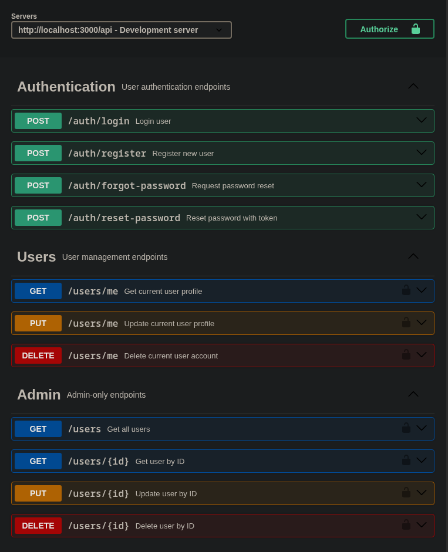

# User Management System

A robust and secure user management system built with Node.js, Fastify, Prisma, and SQLite. This REST API provides comprehensive user authentication, profile management, and admin capabilities.

## Features

- 🔐 **Authentication System**
  - User registration and login
  - JWT-based authentication
  - Password reset functionality with secure tokens
  
- 👤 **User Profile Management**
  - View and update user profiles
  - Account deletion
  - Self-service profile operations

- 🛡️ **Admin Panel**
  - User listing and search
  - User management (view, update, delete)
  - Role-based access control

- ⚡ **Modern Tech Stack**
  - **Fastify** - Fast and low overhead web framework
  - **Prisma** - Next-generation ORM
  - **SQLite** - Lightweight database
  - **JWT** - Secure authentication tokens

## Prerequisites

- Node.js (v14 or higher)
- npm or yarn

## Installation

1. **Clone the repository**
   ```bash
   git clone <repository-url>
   cd <repository-name>
   ```

2. **Install dependencies**
   ```bash
   npm install
   ```

3. **Configure environment variables**
   
   Copy the example environment file and configure your settings:
   ```bash
   cp .example_env .env
   ```

4. **Setup database**
   
   Generate Prisma client:
   ```bash
   npx prisma generate
   ```
   
   Run database migrations:
   ```bash
   npx prisma migrate dev --name init
   ```

5. **Start the server**
   ```bash
   npm run start
   ```

The server will start running on the configured port (default: 3000).

## Project Structure

```
repo
├── .example_env              # Environment variables template
├── openapi.yaml              # API documentation (OpenAPI/Swagger spec)
├── package.json              # Project dependencies and scripts
├── prisma
│   ├── migrations            # Database migration files
│   └── schema.prisma         # Prisma schema definition
└── src
    ├── db.js                 # Database connection setup
    ├── middleware
    │   ├── admin.js          # Admin authorization middleware
    │   └── auth.js           # Authentication middleware
    ├── routes
    │   ├── auth.js           # Authentication endpoints
    │   └── users.js          # User management endpoints
    └── server.js             # Main application entry point
```

## API Endpoints

### Authentication

| Method | Endpoint | Description | Auth Required |
|--------|----------|-------------|---------------|
| POST | `/auth/register` | Register a new user | No |
| POST | `/auth/login` | Login user | No |
| POST | `/auth/forgot-password` | Request password reset | No |
| POST | `/auth/reset-password` | Reset password with token | No |

### User Profile

| Method | Endpoint | Description | Auth Required |
|--------|----------|-------------|---------------|
| GET | `/users/me` | Get current user profile | Yes |
| PUT | `/users/me` | Update current user profile | Yes |
| DELETE | `/users/me` | Delete current user account | Yes |

### Admin Operations

| Method | Endpoint | Description | Auth Required |
|--------|----------|-------------|---------------|
| GET | `/users` | Get all users | Admin |
| GET | `/users/{id}` | Get user by ID | Admin |
| PUT | `/users/{id}` | Update user by ID | Admin |
| DELETE | `/users/{id}` | Delete user by ID | Admin |

## Database Schema
### User Table
Stores user account information including credentials and profile data.

   

### PasswordReset Table
Manages password reset tokens and their expiration times for secure password recovery.

   

## API Documentation
   


The API is fully documented using OpenAPI 3.0 specification. You can:

- View the `openapi.yaml` file in the root dir.
- Access the interactive Swagger UI at `/docs` when the server is running.
- Import the OpenAPI spec into tools like Postman or Insomnia.

## Security Features

- Password hashing with bcrypt
- JWT token-based authentication
- Protected routes with middleware
- Role-based access control (User/Admin)
- Secure password reset flow with time-limited tokens

## Development

### Database Management

View database in Prisma Studio:
```bash
npx prisma studio
```

Create a new migration:
```bash
npx prisma migrate dev --name <migration-name>
```

Reset database:
```bash
npx prisma migrate reset
```

## Environment Variables

Configure the following in your `.env` file:

- `DATABASE_URL` - SQLite database connection string
- `JWT_SECRET` - Secret key for JWT token generation
- `PORT` - Server port (default: 3000)
- Additional configuration as needed

## License

MIT License

## Support

For issues and questions, please open an issue in the repository.

